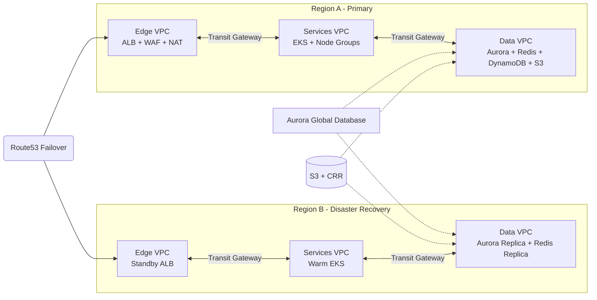

# Hospital HMS EKS Platform

The **hospital-hms-eks** project provisions a production-ready Hospital Management System (HMS) platform across two AWS regions with Terraform. It builds a resilient multi-VPC topology, deploys a microservices application to Amazon EKS with Helm, and configures disaster recovery (DR) failover using Route53 and Aurora Global Database.

## 📐 Architecture Overview

- **Region A (Primary)**
  - **Edge VPC** – Public subnets hosting an internet-facing Application Load Balancer (ALB), AWS WAF/CloudFront integrations, and a Transit Gateway attachment.
  - **Services VPC** – Private subnets for the Amazon EKS control plane and managed node groups. Dedicated egress subnets host NAT gateways so workloads can reach the internet through the Edge VPC.
  - **Data VPC** – Private subnets for Aurora PostgreSQL, DynamoDB, ElastiCache for Redis, Amazon S3 medical report storage, and HealthLake integrations.
- **Region B (DR)** mirrors the Edge/Services/Data VPC layout with a warm-standby EKS cluster and Aurora replica.
- **Networking** uses Transit Gateway attachments to interconnect the VPCs for east-west traffic while keeping tiers isolated.
- **Data layer** consists of an Aurora PostgreSQL global database, DynamoDB audit table, Redis caching tier, and S3 with cross-region replication.
- **Application layer** runs four microservices (frontend, backend, telemedicine, notification) on EKS with AWS Load Balancer Controller ingress and autoscaling policies.
- **Resilience** is handled by Route53 failover records, CloudWatch alarms, and SNS notifications that promote Region B when Region A is unhealthy.



## ⚙️ Terraform Configuration

The Terraform root module lives at the repository root (`main.tf`, `variables.tf`, `outputs.tf`). Key infrastructure components:

- Three VPCs per region (Edge, Services, Data) with dedicated subnets and Transit Gateway attachments.
- Amazon EKS clusters (primary + warm standby) with managed node groups in private subnets.
- Aurora PostgreSQL global database with replication to the DR region.
- DynamoDB for audit logs, ElastiCache for Redis caching, and S3 buckets with cross-region replication for medical reports.
- Amazon Cognito user pool for patient/provider authentication.
- ECR repositories for each HMS microservice.
- Route53 failover records, health checks, CloudWatch alarms, and SNS notifications for automated disaster recovery.

## 🖥️ AWS CLI Setup on Windows

1. Download and install the [AWS CLI MSI](https://docs.aws.amazon.com/cli/latest/userguide/getting-started-install.html#getting-started-install-instructions).
2. Open **PowerShell** as Administrator and configure your credentials:
   ```powershell
   aws configure --profile default
   ```
3. Verify connectivity:
   ```powershell
   aws sts get-caller-identity --profile default
   ```

## 🔧 Terraform Usage

1. Copy the provided `terraform.tfvars.example` (or craft your own) with values for:
   - `aurora_master_password`
   - `route53_zone_id`
   - `route53_record_name`
   - ACM certificate ARNs
   - GitHub repository metadata
2. Initialise Terraform and review the plan:
   ```bash
   terraform init
   terraform plan
   ```
3. Apply the infrastructure:
   ```bash
   terraform apply
   ```
4. Configure kubectl for the primary cluster:
   ```bash
   aws eks update-kubeconfig --region <region> --name <cluster>
   kubectl get pods -A
   ```

## 🚀 Application Deployment

Terraform installs four Helm releases (`frontend`, `backend`, `telemedicine`, `notification`) from the local `helm/` directory via the Helm provider. Each chart ships with a Deployment, Service, Ingress, HorizontalPodAutoscaler, and VerticalPodAutoscaler to ensure responsive scaling.

Pods run on private subnets while egress traffic flows through NAT gateways. The AWS Load Balancer Controller provisions an internet-facing ALB that exposes:

- `/` → React frontend
- `/api` → Express backend API
- `/tele` → WebRTC telemedicine service
- `/notify` → Notification gateway

## 🔁 Disaster Recovery & Failover

- **Aurora Global Database** keeps Region B in sync and allows fast failover if the primary writer becomes unavailable.
- **S3 Cross-Region Replication** ensures medical records are duplicated to the standby bucket.
- **Route53 Failover records** monitor ALB health checks in each region. If Region A fails health checks, traffic automatically routes to Region B.
- **CloudWatch + SNS** publish alerts when ALB health degrades so operators can track failovers in real time.
- The standby EKS cluster keeps minimal capacity (1 node) and scales after failover via the same Helm charts.

## 📈 Autoscaling

- **HorizontalPodAutoscaler** objects (min 2 / max 10 / target 60% CPU) handle sudden demand spikes.
- **VerticalPodAutoscaler** objects evaluate pod resource requests and adjust to baseline usage automatically.
- Cluster autoscaling is enabled through the managed node group configuration.

## ✅ Validating the Deployment

After Terraform completes:

1. Retrieve the ALB DNS name from the outputs or Route53 record.
2. Visit the hostname in a browser to access the HMS frontend.
3. Hit `/api/health`, `/tele/health`, and `/notify/health` endpoints to confirm microservice readiness.
4. Simulate a failover by marking the primary ALB health check as unhealthy (e.g., via maintenance) and observe Route53 routing to the DR ALB.

## 📂 Repository Layout

```
hospital-hms-eks/
├─ main.tf
├─ variables.tf
├─ outputs.tf
├─ helm/
│  ├─ frontend/
│  ├─ backend/
│  ├─ telemedicine/
│  └─ notification/
├─ k8s/
│  ├─ hpa.yaml
│  └─ vpa.yaml
├─ .github/workflows/deploy.yml
└─ README.md
```

## 🧪 Local Testing

Use the provided manifest snippets in `k8s/` to quickly test autoscaling behaviour in a non-production cluster.

## 🤖 CI/CD Workflow

The GitHub Actions workflow (`.github/workflows/deploy.yml`) performs three phases on every push to `main`:

1. Build and push Docker images for all microservices to Amazon ECR using OIDC-based authentication (`AWS_DEPLOY_ROLE_ARN`).
2. Execute `terraform init` and `terraform apply` from the `hospital-hms-eks` directory to provision or update AWS infrastructure.
3. Run `helm dependency update` followed by `helm upgrade --install hms helm/ -n hms-prod` to synchronise Kubernetes manifests with the latest container images.

### Required repository secrets/variables

| Name | Type | Purpose |
| --- | --- | --- |
| `AWS_DEPLOY_ROLE_ARN` | Secret | IAM role ARN assumable by GitHub OIDC. |
| `AURORA_MASTER_PASSWORD` | Secret | Secure password for the Aurora writer instance. |
| `PRIMARY_CERT_ARN` / `DR_CERT_ARN` | Secret | ACM certificates for HTTPS listeners. |
| `ROUTE53_ZONE_ID` | Secret | Hosted zone ID for HMS DNS. |
| `ROUTE53_RECORD_NAME` | Variable | Fully qualified DNS name exposed to users. |
| `PRIMARY_HEALTH_FQDN` / `DR_HEALTH_FQDN` | Variable | Health check endpoints for Route53 failover. |
| `COGNITO_CALLBACK_URLS` / `COGNITO_LOGOUT_URLS` | Variable | JSON arrays of allowed Cognito callback and logout URLs. |
| `AWS_PRIMARY_REGION` / `AWS_DR_REGION` | Variable | Override default regions if required. |

> ℹ️ Define Cognito URL lists as JSON strings (e.g. `['https://app.example.com/callback']`) so Terraform can parse them into list variables.

